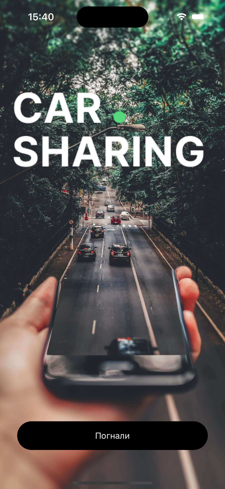
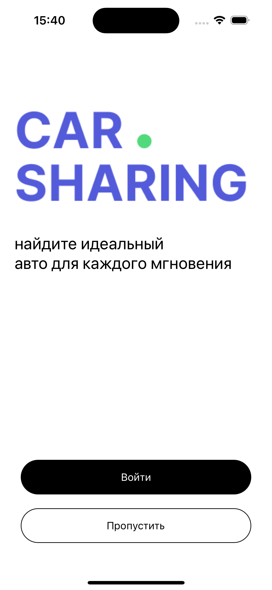
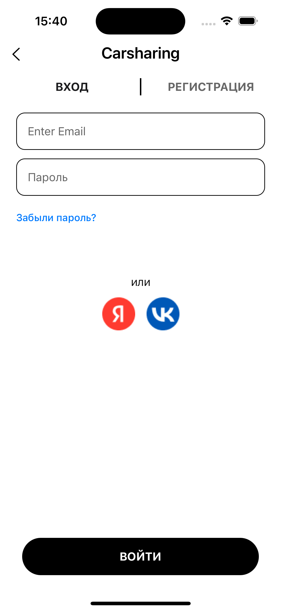
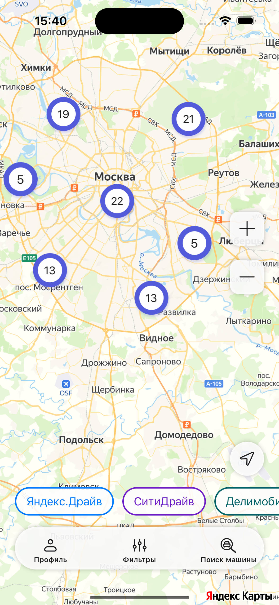

# Find and GO

# Ссылки

Дизайн в Figma - [посмотреть](https://www.figma.com/file/ubkBwKt1JpNrIhYzWHJdNv/Агрегатор-каршеринга?type=design&node-id=730-9413&mode=design&t=TM5epAcWfBOYRtnw-0)

# Изображения
  
  
  
  
# Назначение и цели приложения

"Find and GO" - агрегатор каршеринга, приложение предназначено для поиска автомобиля и дальнейшего бронирования при переходе в соответсвующее приложение каршеринга.

Цели приложения:

- Предоставить пользователю информацию о доступных автомобилях разных каршерингов.
- Фильтр автомобилей.
- Возможность оставить отзыв о каршеринге

# Краткое описание приложения

- В приложении предусмотрена регистрация пользователя через электронную почту. Есть возможность входа через соц сети Яндекс ID/VK ID.
- Авторизованный пользователь имеет возможность сохранять историю поиска и оценивать агрегаторы каршеринга.
- На главном экране находится карта с автомобилями разных каршерингов, доступных для бронирования.
- Пользователи могут зуммить карту, отображать свою геолокацию на карте.
- При клике на иконку автомобиля открывается окно с краткой информацией о выбранной машине, адресе и с кнопкой для перехода в приложение каршеринга.
- С главного экрана можно перейти в экран с информацией о профиле, экран с фильтрами или экран поиска авто.
